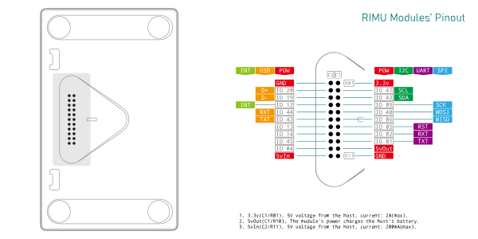
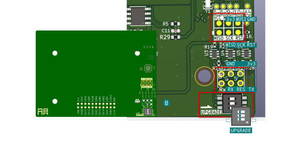
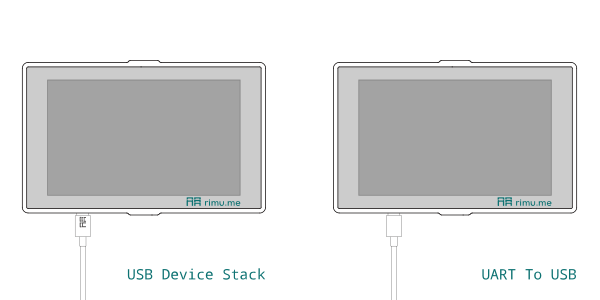

# The general information of WF1 Modules

- [The general information of WF1 Modules](#the-general-information-of-wf1-modules)
  - [Overview](#overview)
  - [Module Pins](#module-pins)
    - [Notes](#notes)
  - [Firmware Update](#firmware-update)
    - [Upgrading Module Firmware Using the Host](#upgrading-module-firmware-using-the-host)
    - [Other Methods for Upgrading Firmware](#other-methods-for-upgrading-firmware)
  - [Communication](#communication)
    - [I2C Protocol](#i2c-protocol)
    - [Human-Machine Interaction](#human-machine-interaction)
    - [Timed Reading](#timed-reading)
    - [Interrupt Triggering](#interrupt-triggering)
  - [Pin Definitions](#pin-definitions)
    - [I2C Pins](#i2c-pins)
    - [UART Pins](#uart-pins)
    - [USB](#usb)
      - [Normal Insertion - USB Device](#normal-insertion---usb-device)
      - [Reverse Insertion - USB Serial Port](#reverse-insertion---usb-serial-port)
    - [SPI Pins](#spi-pins)
    - [Interrupt Pins](#interrupt-pins)
    - [Non-protocol Pins](#non-protocol-pins)
  - [Registers](#registers)
    - [General Registers](#general-registers)
    - [Private Registers](#private-registers)
    - [Address List](#address-list)
    - [Module Number](#module-number)
    - [Total Bits](#total-bits)
    - [Hardware Version](#hardware-version)
    - [Software Version](#software-version)
    - [Communication Protocol](#communication-protocol)
    - [Checksum](#checksum)
    - [Reserved Bits](#reserved-bits)
    - [New Data Flag](#new-data-flag)
    - [Module Name](#module-name)
    - [Pin Status](#pin-status)
      - [0 - Isolated Pin (0b00)](#0---isolated-pin-0b00)
      - [1 - Pin was connected, but not used (0b01)](#1---pin-was-connected-but-not-used-0b01)
      - [2 - Pin is used, and can be modified by the host (0b10)](#2---pin-is-used-and-can-be-modified-by-the-host-0b10)
      - [3 - Pin is used, and cannot be modified by the host (0b11)](#3---pin-is-used-and-cannot-be-modified-by-the-host-0b11)
    - [Register Address and Pin Function Table](#register-address-and-pin-function-table)
      - [Priority](#priority)
    - [Interrupt Trigger Bit](#interrupt-trigger-bit)
  - [Private Information Registers](#private-information-registers)

## Overview

Communication between the RIMU host and modules is primarily achieved through the I2C bus, while also supporting other special modules. The specific choice of modules mainly depends on the required functionalities, costs, protection levels, and different application scenarios.

This document provides detailed information on customizable I2C protocol modules, such as the DIMMER5 module and the 8-channel IO expansion module.

Currently, all modules use the Atmega328p as the main processor. This chip is designed to handle as many events as possible on its own and communicates with the host via the I2C protocol, such as controlling IO ports and reading sensor information. This design effectively reduces the usage of the host's IO ports. If the Atmega328p cannot meet specific requirements, the host's IO ports will be used for processing, while supporting IO port switching, allowing the host to connect multiple devices.

## Module Pins

Different modules may use different pins. During the design phase, the module's own pins should be utilized as much as possible to minimize the usage of the host's IO ports.

|        |  R01  |  R02  |  R03  |  R04  |  R05  |  R06  |  R07  |  R08  |  R09  |  R10  |  R11  |
| -----: | :---: | :---: | :---: | :---: | :---: | :---: | :---: | :---: | :---: | :---: | :---: |
| **C1** | 3.3v¹ | IO41  | IO42  | IO09  | IO40  | IO06  | IO05  | IO02  | IO01  |  5V²  |  GND  |
| **C2** |  GND  | IO20  | IO19  | IO12⁴ | IO44  | IO43  | IO13  | IO14  | IO45  | IO04  |  5V³  |

### Notes

1. Maximum output current: 2A, supplied by the host.
2. Module power: charges the host's battery.
3. Maximum output current: 200mA, supplied by the host.
4. **IO12** pin: This pin is primarily used for interrupt signals to the host.

## Firmware Update

### Upgrading Module Firmware Using the Host

To upgrade the module firmware using the host, follow these steps:

1. Use a screwdriver to open the module, referring to the UPGRADE position in the above diagram C, and set all three dip switches to the ON position.
2. Reattach the module's top cover (once the cover is secured, the module can communicate smoothly with the host).
3. Click "Upgrade" on the screen to start the firmware upgrade.
4. After a successful upgrade, remove the module's top cover and switch the dip switches to the OFF position.
5. Reattach the module's top cover, and the module can communicate smoothly with the host again.

### Other Methods for Upgrading Firmware

Users with certain programming and hardware skills can also upgrade the firmware through other methods, such as:

1. When programming the module using Arduino, it can be upgraded via a USB-to-serial module (requiring the DTR pin), as shown in diagram B.
2. Firmware can be upgraded via the SPI interface, as shown in diagram A.

## Communication

Communication between the host and modules occurs via the I2C bus. The I2C slave address must be unique, and the module can set its I2C address using dip switches. Using a 16-position rotary dip switch, the module can be assigned 16 different addresses, allowing the host to connect up to **16** modules simultaneously. The types of communication between the host and modules are as follows:

1. Human-machine interaction: The host reads or sends data to the module.
2. Timed reading: Some modules require the host to periodically read their data, such as module status or sensor readings.
3. Interrupt triggering: When the module has new information, it notifies the host to read the module information by pulling the interrupt pin high.

### I2C Protocol

1. **Address Range**：**0x60** - **0x6F**, corresponding to the dip switch positions **0** - **F**.
2. **Communication Speed**：**400KHz**。
3. **Level**: **3.3V**。

### Human-Machine Interaction

When the host controls the module, it reads or sends data to the module based on its needs.

### Timed Reading

Certain input-type modules require the host to periodically read their data, such as module status or sensor readings.

### Interrupt Triggering

When the module has new information, it can trigger an interrupt. The host first confirms which module triggered the interrupt and then reads the corresponding module's register information.

## Pin Definitions

Each protocol uses its own pin definitions, so during the hardware design of the module, it is necessary to avoid these pins as much as possible to prevent pin conflicts.

### I2C Pins

All modules have the same I2C pins. Different modules need to select different addresses using dip switches, as shown in the diagram below:

|         |  R1   |   R2    |   R3    |  R4   |  R5   |  R6   |  R7   |  R8   |  R9   |  R10  |  R11  |
| ------: | :---: | :-----: | :-----: | :---: | :---: | :---: | :---: | :---: | :---: | :---: | :---: |
|  **C1** | 3.3v  |  IO41   |  IO42   | IO09  | IO40  | IO06  | IO05  | IO02  | IO01  |  5V   |  GND  |
|  **C2** |  GND  |  IO20   |  IO19   | IO12  | IO44  | IO43  | IO13  | IO14  | IO45  | IO04  |  5V   |
|         |       |         |         |       |       |       |       |       |       |       |       |
| **I2C** |   -   | **SCL** | **SDA** |   -   |   -   |   -   |   -   |   -   |   -   |   -   |   -   |
| **I2C** |   -   |    -    |    -    |   -   |   -   |   -   |   -   |   -   |   -   |   -   |   -   |

### UART Pins

Some modules require the use of serial communication, such as RS485, CAN, DMX512, etc. Additionally, the UART interface and RESET pin are needed when updating the module firmware. Since the operation of updating the module firmware is not common, the **TX** and **RX** pins for communication and firmware updates are shared. The **RESET (RST)** pin is only used during firmware updates. The pin positions are shown in the diagram below:

|          |  R1   |  R2   |  R3   |  R4   |  R5   |  R6   |   R7    |   R8   |   R9   |  R10  |  R11  |
| -------: | :---: | :---: | :---: | :---: | :---: | :---: | :-----: | :----: | :----: | :---: | :---: |
|   **C1** | 3.3v  | IO41  | IO42  | IO09  | IO40  | IO06  |  IO05   |  IO02  |  IO01  |  5V   |  GND  |
|   **C2** |  GND  | IO20  | IO19  | IO12  | IO44  | IO43  |  IO13   |  IO14  |  IO45  | IO04  |  5V   |
|          |       |       |       |       |       |       |         |        |        |       |       |
| **UART** |   -   |   -   |   -   |   -   |   -   |   -   | **RST** | **RX** | **TX** |   -   |   -   |
| **UART** |   -   |   -   |   -   |   -   |   -   |   -   |    -    |   -    |   -    |   -   |   -   |

> The dip switch for upgrading firmware is set to **OFF** when the module leaves the factory. If firmware upgrade is needed, please switch the dip switch to **ON**. For normal use, the dip switch should be set to **OFF**.

### USB

The host is equipped with a TYPE-C interface, with different functions for normal insertion and reverse insertion:

1. **Normal Insertion** (same side as RIMU logo and screen): The host can simulate devices such as keyboards, mice, USB drives, and game controllers.
2. **Reverse Insertion** (opposite side of RIMU logo and screen): Used for upgrading programs and debugging, with the connection method being *computer* -> *CH9102X* -> *ESP32S3*.

#### Normal Insertion - USB Device

When using the USB interface, the host can simulate devices such as keyboards, mice, USB drives, and game controllers. At this time, the **IO19** and **IO20** pins will be occupied.

|             |  R1   |   R2   |   R3   |  R4   |  R5   |  R6   |  R7   |  R8   |  R9   |  R10  |  R11  |
| ----------: | :---: | :----: | :----: | :---: | :---: | :---: | :---: | :---: | :---: | :---: | :---: |
|      **C1** | 3.3V  |  IO41  |  IO42  | IO09  | IO40  | IO06  | IO05  | IO02  | IO01  |  5V   |  GND  |
|      **C2** |  GND  |  IO20  |  IO19  | IO12  | IO44  | IO43  | IO13  | IO14  | IO45  | IO04  |  5V   |
|             |       |        |        |       |       |       |       |       |       |       |       |
| **USB-HID** |   -   |   -    |   -    |   -   |   -   |   -   |   -   |   -   |   -   |   -   |   -   |
| **USB-HID** |   -   | **D+** | **D-** |   -   |   -   |   -   |   -   |   -   |   -   |   -   |   -   |

#### Reverse Insertion - USB Serial Port

When using the TYPE-C serial port, the **IO43** and **IO44** pins will be occupied. The host can act as a serial port for debugging or upgrading programs.

|              |  R1   |  R2   |  R3   |  R4   |   R5   |   R6   |  R7   |  R8   |  R9   |  R10  |  R11  |
| -----------: | :---: | :---: | :---: | :---: | :----: | :----: | :---: | :---: | :---: | :---: | :---: |
|       **C1** | 3.3V  | IO41  | IO42  | IO09  |  IO40  |  IO06  | IO05  | IO02  | IO01  |  5V   |  GND  |
|       **C2** |  GND  | IO20  | IO19  | IO12  |  IO44  |  IO43  | IO13  | IO14  | IO45  | IO04  |  5V   |
|              |       |       |       |       |        |        |       |       |       |       |       |
| **USB-UART** |   -   |   -   |   -   |   -   |   -    |   -    |   -   |   -   |   -   |   -   |   -   |
| **USB-UART** |   -   |   -   |   -   |   -   | **RX** | **TX** |   -   |   -   |   -   |   -   |   -   |

### SPI Pins

Some modules require higher-speed data transmission and will use the SPI protocol. The chip select pin is controlled by the Atmega328p, allowing multiple modules to connect to one SPI bus. The SPI pin definitions are as follows:

|         |  R1   |  R2   |  R3   |   R4    |    R5    |    R6    |  R7   |  R8   |  R9   |  R10  |  R11  |
| ------: | :---: | :---: | :---: | :-----: | :------: | :------: | :---: | :---: | :---: | :---: | :---: |
|  **C1** | 3.3V  | IO41  | IO42  |  IO09   |   IO40   |   IO06   | IO05  | IO02  | IO01  |  5V   |  GND  |
|  **C2** |  GND  | IO20  | IO19  |  IO12   |   IO44   |   IO43   | IO13  | IO14  | IO45  | IO04  |  5V   |
|         |       |       |       |         |          |          |       |       |       |       |       |
| **SPI** |   -   |   -   |   -   | **SCK** | **MOSI** | **MISO** |   -   |   -   |   -   |   -   |   -   |
| **SPI** |   -   |   -   |   -   |    -    |    -     |    -     |   -   |   -   |   -   |   -   |   -   |

### Interrupt Pins

Modules with interrupt functionality can notify the host of new information via the interrupt pin. Since this interrupt pin shares the same pin with the host's internal peripherals, the host must first confirm which module triggered the interrupt before reading the corresponding module's register information. The pin positions are as follows:

|               |  R1   |  R2   |  R3   |   R4    |  R5   |  R6   |  R7   |  R8   |  R9   |  R10  |  R11  |
| ------------: | :---: | :---: | :---: | :-----: | :---: | :---: | :---: | :---: | :---: | :---: | :---: |
|        **C1** | 3.3V  | IO41  | IO42  |  IO09   | IO40  | IO06  | IO05  | IO02  | IO01  |  5V   |  GND  |
|        **C2** |  GND  | IO20  | IO19  |  IO12   | IO44  | IO43  | IO13  | IO14  | IO45  | IO04  |  5V   |
|               |       |       |       |         |       |       |       |       |       |       |       |
| **INTERRUPT** |   -   |   -   |   -   |    -    |   -   |   -   |   -   |   -   |   -   |   -   |   -   |
| **INTERRUPT** |   -   |   -   |   -   | **INT** |   -   |   -   |   -   |   -   |   -   |   -   |   -   |

### Non-protocol Pins

These non-protocol pins are not occupied by any protocol. During the design of the module hardware, these pins should be prioritized. Additionally, the **IO05** pin is only used during firmware upgrades.

|                      |  R1   |  R2   |  R3   |  R4   |  R5   |  R6   |  R7   |  R8   |  R9   |  R10  |  R11  |
| -------------------: | :---: | :---: | :---: | :---: | :---: | :---: | :---: | :---: | :---: | :---: | :---: |
|               **C1** | 3.3V  | IO41  | IO42  | IO09  | IO40  | IO06  | IO05  | IO02  | IO01  |  5V   |  GND  |
|               **C2** |  GND  | IO20  | IO19  | IO12  | IO44  | IO43  | IO13  | IO14  | IO45  | IO04  |  5V   |
|                      |       |       |       |       |       |       |       |       |       |       |       |
| **Non-protocol Pin** |   -   |   -   |   -   |   -   |   -   |   -   |  *Y*  |   -   |   -   |   -   |   -   |
| **Non-protocol Pin** |   -   |   -   |   -   |   -   |   -   |   -   |   Y   |   Y   |   Y   |   Y   |   -   |

## Registers

The total number of registers is a maximum of **0xFF**, consisting of general and private parts.

### General Registers

- **0x00** - **0x41**, a total of **0x42** bits, common to all modules.
- **0x05** (REG_NEW_DATA_FLAG)：Read/Write
- **0x41** (REG_INTERRUPT_FLAG)：Read/Write
- Other bits: Read-only

### Private Registers

- **0x42** - **0xFF**, defined by each module, with a maximum of **0xFF** - **0x42** = **0xBD** bits for private registers.
- Each module's registers have corresponding functionalities.
- Read/Write permissions are defined by the module itself.

### Address List

|               Address | Function                  | R/W  | Comments |
| --------------------: | :------------------------ | :--- | :------- |
|             `0x00/02` | Module Number             | R    |          |
|             `0x01/03` | Module Number             | R    |          |
|                `0x04` | Total Number of Registers | R    |          |
|                `0x05` | Hardware Version          | R    |          |
|                `0x06` | Software Version          | R    |          |
|                `0x07` | Functions Used            | R    |          |
|                `0x08` | Checksum                  | R    |          |
| `0x09/0A/0B/0C/0D/0E` | Reversed                  | R    |          |
|                `0x0E` | New data flag             | R/W  |          |
|          `0x10->0x2F` | Module Name               | R    |          |
|                `0x30` | PIN-01 Status             | R    |          |
|                `0x31` | PIN-02 Status             | R    |          |
|                `0x32` | PIN-04 Status             | R    |          |
|                `0x33` | PIN-05 Status             | R    |          |
|                `0x34` | PIN-06 Status             | R    |          |
|                `0x35` | PIN-09 Status             | R    |          |
|                `0x36` | PIN-12 Status             | R    |          |
|                `0x37` | PIN-13 Status             | R    |          |
|                `0x38` | PIN-14 Status             | R    |          |
|                `0x39` | PIN-19 Status             | R    |          |
|                `0x3A` | PIN-20 Status             | R    |          |
|                `0x3B` | PIN-40 Status             | R    |          |
|                `0x3C` | PIN-41 Status             | R    |          |
|                `0x3D` | PIN-42 Status             | R    |          |
|                `0x3E` | PIN-43 Status             | R    |          |
|                `0x3F` | PIN-44 Status             | R    |          |
|                `0x40` | PIN-45 Status             | R    |          |
|                `0x41` | Interrupt Flag            | R/W  |          |

### Module Number

Each module has a different and unique number, ranging from **0x0001** to **0xFFFF**. Different versions of the same module use the same number. The hardware version is used to distinguish between hardware. To ensure the correct identification of the module, the system stores the number twice to prevent the I2C from connecting to other devices.

|   0x00/0x02 |  B7   |  B6   |  B5   |  B4   |  B3   |  B2   |  B1   |  B0   |
| ----------: | :---: | :---: | :---: | :---: | :---: | :---: | :---: | :---: |
| High 8 Bits |   0   |   0   |   0   |   0   |   0   |   0   |   0   |   0   |

|  0x01/0x03 |  B7   |  B6   |  B5   |  B4   |  B3   |  B2   |  B1   |  B0   |
| ---------: | :---: | :---: | :---: | :---: | :---: | :---: | :---: | :---: |
| Low 8 Bits |   0   |   0   |   0   |   0   |   0   |   0   |   0   |   0   |

### Total Bits

The total number of registers ranges from **0x00** to **0xFF**, equal to the number of general registers plus the number of private registers. This total number is stored at address **0x04**.

| 0x04 |  B7   |  B6   |  B5   |  B4   |  B3   |  B2   |  B1   |  B0   |
| ---: | :---: | :---: | :---: | :---: | :---: | :---: | :---: | :---: |
|  Val |   0   |   0   |   0   |   0   |   0   |   0   |   0   |   0   |

### Hardware Version

The hardware version of the module increments among modules with the same functionality, ranging from **1** to **255**, with the first version being 1. This version information is stored at address **0x05**.

| 0x05 |  B7   |  B6   |  B5   |  B4   |  B3   |  B2   |  B1   |  B0   |
| ---: | :---: | :---: | :---: | :---: | :---: | :---: | :---: | :---: |
|  Val |   0   |   0   |   0   |   0   |   0   |   0   |   0   |   0   |

### Software Version

The software version of the module can be upgraded via the host, ranging from 1 to 255, with the first version being 1. This version information is stored at address **0x06**.

Firmware updates do not modify the data in the EEPROM, but during module initialization, the old data may be used, which could lead to data errors. The software version also serves to determine whether data should be read from the EEPROM to initialize the module.

| 0x06 |  B7   |  B6   |  B5   |  B4   |  B3   |  B2   |  B1   |  B0   |
| ---: | :---: | :---: | :---: | :---: | :---: | :---: | :---: | :---: |
|  Val |   0   |   0   |   0   |   0   |   0   |   0   |   0   |   0   |

### Communication Protocol

Different modules have different functionalities, so the required communication protocols also vary. The protocol used by this module is stored at register **0x07** for the host to identify.

Each bit represents the communication protocol used by the module, with 0 indicating not in use and 1 indicating currently in use. All modules support the I2C protocol.

|     0x07 |  B7   |  B6   |   B5    |   B4    |    B3    |    B2     |  B1   |  B0   |
| -------: | :---: | :---: | :-----: | :-----: | :------: | :-------: | :---: | :---: |
| Protocal |   -   |   -   | UPGRADE | USB-HID | USB-UART | INTERRUPT | UART  |  SPI  |

1. **UPGRADE**: The module can be upgraded via the host.
2. **INTERRUPT**: The module has interrupt trigger functionality, notifying the host when the module's status changes.
3. **UART**: The module uses serial pins for communication.
4. **SPI**: The module uses the SPI protocol for data transmission.
5. **USB-HID**:The module uses **IO19** and **IO20** pins, which will disable the host's ability to simulate HID device functionality.
6. **USB-UART**:The module uses **IO43** and **IO44** pins, which will disable the host's TYPE-C interface from functioning as a serial port.

### Checksum

The checksum value is the low eight bits of the sum from **0x00** to **0x07**. This checksum is stored at address **0x08**.

| 0x08 |  B7   |  B6   |  B5   |  B4   |  B3   |  B2   |  B1   |  B0   |
| ---: | :---: | :---: | :---: | :---: | :---: | :---: | :---: | :---: |
|  Val |   0   |   0   |   0   |   0   |   0   |   0   |   0   |   0   |

### Reserved Bits

The address range 0x09 - 0x0E is reserved, unused, and has a value of **0**.

### New Data Flag

If the module has new data, this value needs to be incremented. When the host polls, it first reads this register. If the value is not **0**, it continues to read other registers and then clears it. This value is stored at address 0x0F. If the value of this register is large, the host needs to shorten the polling interval.

| 0x0F |  B7   |  B6   |  B5   |  B4   |  B3   |  B2   |  B1   |  B0   |
| ---: | :---: | :---: | :---: | :---: | :---: | :---: | :---: | :---: |
|  Val |   0   |   0   |   0   |   0   |   0   |   0   |   0   |   0   |

### Module Name

The module name must be unique and start with "WF1-", with a maximum of 32 characters following it, consisting only of letters, numbers, or hyphens (-). The module name is stored in the register range **0x10** - **0x2F**.

### Pin Status

After confirming the protocol used by the module, the pin status will be initialized when the module is powered on. The pin status is not saved to EEPROM but is initialized by the program in the registers. There are four definitions for the pins, representing different statuses. A total of 2 bits are used to represent different statuses, **BIT0** and **BIT1**, with other bits reserved. The specifics are as follows:

| 0x30 |  B7   |  B6   |  B5   |  B4   |  B3   |  B2   |   B1 | B0   |
| ---: | :---: | :---: | :---: | :---: | :---: | :---: | ---: | :--- |
|  Val |   -   |   -   |   -   |   -   |   -   |   -   |   IO | xx   |

The steps to set the pin status are as follows:

1. The module initializes the pin status according to the protocol.
2. The module sets the status of non-protocol pins during initialization.
3. If the module's pins can be set by the host, they are set through the host.
4. The module saves the pin status to EEPROM for automatic initialization of these pins during the next startup.
5. The host can detect the status of these pins and issue warnings if conflicts are found.

#### 0 - Isolated Pin (0b00)

This pin is not connected to any lines of the module and can be considered a useless pin for this module. These pins cannot be modified by the host. Specific cases include:

1. Unused non-protocol pins.
2. Dedicated pins for protocols not used by this module.

#### 1 - Pin was connected, but not used (0b01)

The pin is connected to the module's lines but is not used by the current module and can be used by other modules. Specific cases include:

1. The three pins used during upgrades: **IO01 TX**, **IO02 RX**, and **IO05 RST**. These three pins are only used during upgrades and can be used by other modules at other times.
2. The default state of non-protocol pins can be set to - 2 (**0b10**) by the host.

#### 2 - Pin is used, and can be modified by the host (0b10)

This status is modified by the host, and the module needs to save the status of these pins to EEPROM.

1. The upgrade pins can be set to a used state by the host.
2. Non-protocol pins set to a used state by the host can be modified by the host if other modules need them.
3. Unused protocol pins, such as SPI and USB, can be modified by the host if this module does not use them.

#### 3 - Pin is used, and cannot be modified by the host (0b11)

The pins used on the module cannot be modified by the host. Specific cases include:

1. The SCL and SDA pins used by the I2C protocol cannot be modified by the host.
2. The interrupt pin **IO12**, used for interrupts, shares the same pin with the host's interrupt and cannot be modified unless in special circumstances.
3. Pins occupied by protocols used by other modules cannot be modified by the host.

If the module uses certain fixed pins, their status must be set to 0b11 and cannot be modified by the host.

### Register Address and Pin Function Table

| address | Pin # | Protocol         | Name                 | Priority |
| ------: | :---- | :--------------- | :------------------- | :------- |
|    0x30 | IO01  | UART/UPGRADE     | TX                   | 1        |
|    0x31 | IO02  | UART/UPGRADE     | RX                   | 1        |
|    0x32 | IO04  | Non-protocol Pin | -                    | 0        |
|    0x33 | IO05  | UPGRADE          | RST                  | 1        |
|    0x34 | IO06  | SPI              | MISO                 | 2        |
|    0x35 | IO09  | SPI              | SCK                  | 2        |
|    0x36 | IO12  | INTERRUPT        | High-Level Triggered | 3        |
|    0x37 | IO13  | Non-protocol Pin | -                    | 0        |
|    0x38 | IO14  | Non-protocol Pin | -                    | 0        |
|    0x39 | IO19  | USD-D            | D+                   | 2        |
|    0x3A | IO20  | USD-D            | D-                   | 2        |
|    0x3B | IO40  | SPI              | MOSI                 | 2        |
|    0x3C | IO41  | I2C              | SCL                  | 3        |
|    0x3D | IO42  | I2C              | SDA                  | 3        |
|    0x3E | IO43  | USB-UART         | TX                   | 2        |
|    0x3F | IO44  | USB-UART         | RX                   | 2        |
|    0x40 | IO45  | Non-protocol Pin | -                    | 0        |

#### Priority

- **0** - Highest priority for use
- **1** - Second priority for use
- **2** - Last priority for use
- **3** - Not to be used unless in special circumstances

### Interrupt Trigger Bit

If the module has information that requires immediate processing by the host, it can notify the host by pulling the interrupt pin high. Since multiple devices share the interrupt, the host needs to read the register values of different modules to quickly determine which module triggered the interrupt. After the host processes this interrupt, it sets this bit to 0, and the module will immediately pull the interrupt pin low. The register address is **0x41**.

## Private Information Registers

All modules' private information registers start from address **0x42**.

